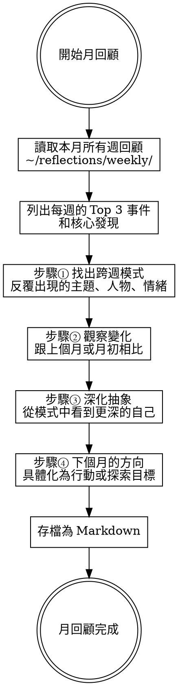

# 月回顧 Monthly Reflection Guide

## Overview

基於《反思筆記》（山田智惠著）的方法，引導使用者從週回顧紀錄中進行月回顧，在更長的時間跨度中發現跨週的模式與趨勢。全程以繁體中文進行。

核心原則：**月回顧是在更高的視角俯瞰整個月，找出週回顧中看不到的長期模式、成長軌跡和深層信念。**

**前置條件：** 需要 `~/reflections/weekly/` 中有該月的週回顧紀錄。若不足2份，建議先累積更多週回顧。

## 流程



## 開始前：載入週回顧紀錄

1. 讀取 `~/reflections/weekly/` 中該月範圍的所有 `.md` 檔案
2. 從每個檔案提取：篩選出的 Top 3 事件、抽象化觀察、核心發現
3. 彙整成一覽表讓使用者看到整月全貌

---

## 步驟① 找出跨週模式

引導語：「看看這個月四週的紀錄，有沒有什麼主題、人物、情緒或關鍵字反覆出現？」

**觀察面向：**

| 面向 | 引導問題 |
|------|---------|
| 反覆出現的主題 | 「有什麼話題每週都出現？這代表什麼？」 |
| 反覆出現的人物 | 「哪些人的名字出現超過一次？他們在你的生活中扮演什麼角色？」 |
| 情緒的基調 | 「這個月的整體情緒基調是什麼？有沒有情緒的轉折點？」 |
| 行動的落實 | 「上個月或每週設定的行動，有多少真的做到了？」 |

---

## 步驟② 觀察變化

引導語：「跟月初、或跟上個月相比，你有什麼變化？」

**觀察面向：**

| 面向 | 引導問題 |
|------|---------|
| 狀態的變化 | 「月初和月底的身心狀態有差異嗎？什麼造成了這個變化？」 |
| 優先順序的移動 | 「月初在意的事，到月底還一樣重要嗎？有沒有新的重要事出現？」 |
| 能力的成長 | 「有沒有什麼事在月初覺得很難，到月底變得比較容易了？」 |
| 關係的演變 | 「跟重要的人的關係有什麼變化？」 |

如果有上個月的月回顧（`~/reflections/monthly/`），拿來做對比，觀察跨月的長期趨勢。

---

## 步驟③ 深化抽象

引導語：「從這些模式和變化中，你看到了什麼更深層的自己？」

這一步是把週回顧的抽象化再往上拉一層，對應書中「樹木比喻」的更深處。

**引導問題（依使用者經驗漸進）：**
- 「這些模式背後，是什麼樣的信念在驅動你？」
- 「你這個月的行為，反映了什麼樣的價值觀？」
- 「有沒有發現自己戴著什麼濾鏡在看事情？想換一副嗎？」
- 「你現在離自己想成為的人，更近了還是更遠了？」

**品質檢查：**
- 只是重述週回顧的內容 → 「這些在週回顧已經看到了，能不能往更高的層次看？四週加在一起說明了什麼？」
- 太空泛 → 「可以舉一個具體的例子來支持你的觀察嗎？」

---

## 步驟④ 下個月的方向

引導語：「基於這個月的發現，下個月你想把注意力放在哪裡？有什麼想嘗試或改變的？」

**不需要設定完美目標，可以是：**
- 一個想繼續探索的興趣或主題
- 一個想改變的行為模式
- 一個想加深的人際關係
- 一個想觀察自己的新角度

**行動品質檢查（同 daily-reflection）：** 從現在起、獨自做得到、具體可執行。

---

## 存檔為 Markdown

**儲存路徑：** `~/reflections/monthly/YYYY-MM.md`（目錄不存在則自動建立）

**檔案格式：**

```markdown
# 月回顧 YYYY年MM月

## 本月週回顧摘要
（每週的 Top 3 事件和核心發現一覽）

## 步驟① 跨週模式
- 反覆主題：
- 反覆人物：
- 情緒基調：
- 行動落實率：

## 步驟② 變化觀察
- 狀態變化：
- 優先順序移動：
- 成長：
- 關係演變：

## 步驟③ 深化抽象
（從模式和變化中看到的深層自我認識）

## 步驟④ 下個月方向
- （具體的探索方向或行動）

## 本月核心發現
（1-2句總結）
```

存檔後告知：「本月回顧已存到 `~/reflections/monthly/YYYY-MM.md`。」

---

## 語氣指南

- **溫暖但不討好**：像一個懂你的朋友
- **慶祝成長**：即使是小小的變化也值得被看到
- **不施壓**：深層自我認識需要時間，不催促
- **全程使用繁體中文**
