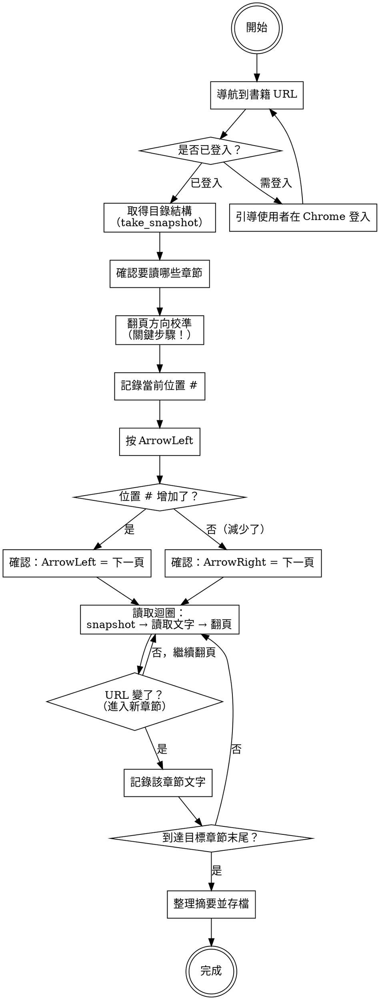

# 讀取 Readmoo 電子書 Reading Readmoo via Chrome

## Overview

透過 Chrome DevTools MCP 連接已登入的 Readmoo 閱讀器，逐章節讀取電子書內容並產出摘要。全程以繁體中文進行。

核心原則：**先確認翻頁方向，再用 accessibility snapshot（而非截圖）高效抓取文字。**

**前置條件：** 使用者的 Chrome 必須已登入 Readmoo 且有該書的閱讀權限。

## 流程



## 步驟① 導航與登入檢查

1. 用 `navigate_page` 開啟書籍 URL（格式：`https://new-read.readmoo.com/mooreader/XXXX`）
2. 檢查是否被重導向到登入頁（URL 含 `auth/signin`）
3. 如果需要登入：告知使用者在 Chrome 中手動登入，登入完成後再次導航

## 步驟② 取得目錄結構

1. 用 `take_snapshot` 取得頁面 accessibility tree
2. 從 snapshot 中找出所有 `link` 元素（含 `xhtml` 的 href），這些是目錄連結
3. 列出完整目錄，問使用者要讀取哪些章節

**目錄辨識方式：** 在 snapshot 中尋找 `link` 元素，其 URL 包含 `/xhtml/p-` 模式，文字內容即為章節名稱。

## 步驟③ 翻頁方向校準（關鍵！）

**不同書籍的翻頁方向不同**（直排中文通常 ArrowLeft = 下一頁，橫排或外文可能相反）。必須先校準。

**校準方法：**

1. 用 `take_snapshot` 記錄當前位置編號（在 snapshot 中找 `位置 #XXX`）
2. 按 `ArrowLeft`
3. 再次 `take_snapshot`，比較位置編號：
   - 位置 # **增加** → `ArrowLeft` = 下一頁（往前翻）
   - 位置 # **減少** → `ArrowRight` = 下一頁（往前翻）
4. 記住正確的翻頁鍵，後續一律使用

**務必在開始讀取前完成校準，不要假設方向。**

## 步驟④ 逐章讀取

### 讀取策略：Snapshot 優先

**使用 `take_snapshot`（而非 `take_screenshot`）**，因為：
- Snapshot 直接提供文字，不需要 OCR
- Snapshot 會抓取整個 EPUB xhtml section 的完整文字，即使畫面只顯示一頁
- 效率遠高於截圖

### 讀取迴圈

```
重複：
  1. take_snapshot → 儲存到 /tmp/page.txt
  2. 讀取 snapshot，提取 EPUB iframe 內的 StaticText 內容
  3. 檢查 iframe 的 URL（xhtml 檔名），判斷是否進入新章節
  4. 如果是新章節：儲存上一章內容，記錄新章節
  5. 按翻頁鍵（校準後確認的方向）
  6. 直到達到目標章節末尾
```

### 判斷章節切換

觀察 snapshot 中 EPUB iframe 的 URL 變化：
- `p-009.xhtml` → `p-010.xhtml` = 進入新 section
- 同一個 xhtml 檔內翻頁 = 同一 section（snapshot 內容相同，只是頁碼不同）

### 判斷一個 section 內需要翻幾頁

從 snapshot 底部的導航資訊可以看到：「本章第 X 頁 / 共 Y 頁」。如果 snapshot 已經抓到完整文字（通常會），可以直接翻 Y 頁跳到下一個 section。

### 位置追蹤

Snapshot 中會包含：
- `位置 #XXX / YYYY` — 目前在全書中的位置
- `XX%` — 閱讀進度百分比
- `本章第 X 頁 / 共 Y 頁` — 章內位置

用這些資訊追蹤進度，判斷是否到達目標章節末尾。

## 步驟⑤ 整理摘要與存檔

1. 將收集到的文字按章節整理
2. 產出**章節摘要**（重點提煉，非逐字轉錄）
3. 存檔到使用者指定位置（預設 `~/book/書名_章節摘要.md`）

**存檔格式：**

```markdown
# 《書名》章節摘要

## 第X章：章節名稱

### 小節名稱
- 重點1
- 重點2
...
```

## 常見問題

| 問題 | 解法 |
|------|------|
| 頁面重導向到登入 | 使用者需在 Chrome 手動登入 |
| Snapshot 抓不到書籍文字 | 文字在跨域 iframe 中，用 snapshot 可以穿透（evaluate_script 不行） |
| 翻頁後 snapshot 內容沒變 | 可能翻頁方向錯了，重新校準 |
| 翻頁後仍在同一 section | 同一 xhtml 可能有多頁，繼續翻即可 |
| 不確定是否到了目標章節 | 檢查 snapshot 中的章節標題和位置 # |
