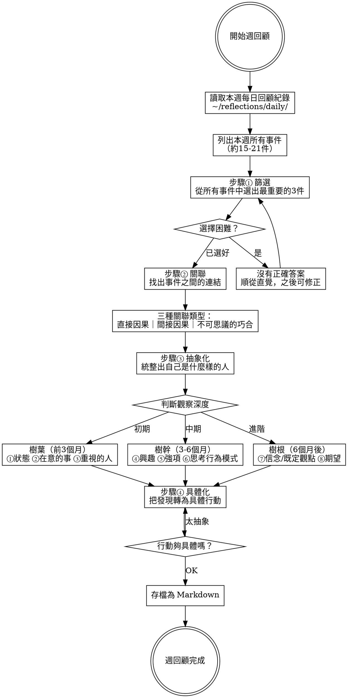

# 週回顧 Weekly Reflection Guide

## Overview

基於《反思筆記》（山田智惠著）的方法，引導使用者從每日紀錄中進行週回顧的四個步驟。全程以繁體中文進行。

核心原則：**從累積的每日紀錄（個人資料庫）中，透過篩選、關聯、抽象化、具體化，逐步深入認識自己。**

**前置條件：** 需要 `~/reflections/daily/` 中有該週的每日回顧紀錄。若紀錄不足，提醒使用者先用 `daily-reflection` skill 累積資料。

## 流程



## 開始前：載入每日紀錄

1. 讀取 `~/reflections/daily/` 中本週（或指定範圍）的所有 `.md` 檔案
2. 從每個檔案中提取「事件」和「核心發現」
3. 列出本週所有事件的清單，讓使用者看到全貌

如果紀錄不足（少於3天），提醒：「這週的紀錄比較少，週回顧的效果可能有限。要繼續進行，還是先補一些每日紀錄？」

---

## 步驟① 篩選：選出最重要的3件事

引導語：「看看這一週的所有紀錄，哪3件事對你來說最重要？不用想太多，跟著直覺走。」

**引導原則：**
- 不要光看事情的大小，要專注在**賦予的意義**（那是你的內在聲音）
- 小事中也可能有重要發現
- 沒有正確答案：「自己選擇的路，就是正確答案」

**選擇困難時的協助：**

| 狀況 | 引導 |
|------|------|
| 「每件都覺得重要」 | 「如果只能跟朋友分享3件事，你會說哪3件？」 |
| 「覺得都不重要」 | 「有沒有哪件事在腦中出現過不只一次？或是讓你情緒波動最大的？」 |
| 「不確定選得對不對」 | 「這就是在訓練篩選的能力。先選了再說，覺得不對可以換。」 |

---

## 步驟② 關聯：找出連結和脈絡

引導語：「看看你選出的3件事，以及這週的其他紀錄，它們之間有什麼關聯嗎？一件事有沒有促成另一件事發生？」

**三種關聯類型：**

| 類型 | 說明 | 範例 |
|------|------|------|
| 直接因果 | A 直接導致 B | 「約了朋友 → 見到面了」 |
| 間接因果 | A 間接影響 B（展現個人獨特性） | 「有獨處時間讀書 → 對家人更有耐心」 |
| 不可思議的巧合 | 看似無關卻相連 | 「隨口問了一句 → 意外得到新機會」 |

**引導問題：**
- 「這件事是怎麼發生的？有沒有什麼前因？」
- 「這週的某個行動，有沒有帶來意想不到的結果？」
- 「有沒有某個人反覆出現在你的紀錄裡？」

**找到關聯後的深化：**
- 「這段關聯教了你什麼？可以怎麼應用在其他地方？」（找出專屬的成功法則）
- 「有沒有當下覺得不起眼，回頭看才發現很重要的事？」（鍛鍊好眼力）

---

## 步驟③ 抽象化：統整出自己是什麼樣的人

引導語：「從這週的紀錄和你找到的關聯裡，有沒有看到什麼關於自己的模式或特質？」

**觀察深度依使用者的反思經驗漸進調整：**

### 樹葉層（初期，前3個月）

| 觀察項目 | 引導問題 |
|---------|---------|
| ①自己的狀態 | 「這週你整體的身心狀態如何？思緒、心情、身體分別怎麼樣？」 |
| ②在意的事 | 「有沒有什麼關鍵字或主題反覆出現在你的紀錄中？」 |
| ③重視的人/貴人 | 「這週有誰對你特別重要？為什麼？」 |

### 樹幹層（中期，3-6個月）

| 觀察項目 | 引導問題 |
|---------|---------|
| ④興趣 | 「你在做什麼事的時候最投入、最忘記時間？」 |
| ⑤強項 | 「這週有哪些事你做得特別順利？別人可能做不到但你覺得理所當然的？」 |
| ⑥思考及行為模式 | 「你有沒有注意到自己在類似情境下，總是用同一種方式反應？」 |

### 樹根層（進階，6個月後）

| 觀察項目 | 引導問題 |
|---------|---------|
| ⑦信念/既定觀點 | 「是什麼樣的信念或價值觀在影響你的反應方式？」 |
| ⑧期望 | 「你心裡最渴望的是什麼？想成為什麼樣的人、過什麼樣的生活？」 |

**判斷使用者目前的深度：** 讀取 `~/reflections/weekly/` 中過往的週回顧紀錄數量。少於12份用樹葉層，12-24份用到樹幹層，超過24份引導到樹根層。如果沒有過往紀錄，從樹葉層開始。

**抽象化品質檢查：**
- 太具體（只是重述事件）→ 「可以再往上拉一層嗎？這幾件事加在一起，說明了你的什麼特質？」
- 太空泛（「我是個好人」）→ 「可以更精確嗎？是哪方面的好？在什麼情境下展現的？」

---

## 步驟④ 具體化：把發現轉為行動

引導語：「根據你剛才的發現，下週有什麼想嘗試或改變的嗎？」

**行動品質檢查（與 daily-reflection 相同）：**

| 原則 | 檢查 |
|------|------|
| 從現在起 | 不是「如果當初…」而是「下週我要…」 |
| 獨自做得到 | 不依賴他人配合 |
| 具體可執行 | 有時間、地點、方式 |

**抽象化 ↔ 具體化的交替：**
- 如果使用者的抽象發現是「我對配色有興趣」→ 引導具體化：「下一步可以做什麼來探索這個興趣？」
- 如果具體行動太跳躍 → 先回到抽象：「這個行動是要達成什麼目的？跟你發現的特質有什麼關係？」

---

## 存檔為 Markdown

**每次週回顧完成後，必須存檔。**

**儲存路徑：** `~/reflections/weekly/YYYY-WXX.md`（XX = ISO 週數，目錄不存在則自動建立）

**檔案格式：**

```markdown
# 週回顧 YYYY-WXX（MM/DD - MM/DD）

## 本週事件清單
（從每日紀錄彙整的所有事件）

## 步驟① 篩選：最重要的3件事
1. （事件 + 為什麼重要）
2. （事件 + 為什麼重要）
3. （事件 + 為什麼重要）

## 步驟② 關聯
（事件之間的連結、因果、發現的成功法則）

## 步驟③ 抽象化
（從紀錄中看到的自己的特質、模式、信念）

### 觀察項目
- 狀態：
- 在意的事：
- 重視的人：
- （視深度加入更多項目）

## 步驟④ 具體化：下週行動
- （具體、從現在起、獨自做得到的行動）

## 本週核心發現
（1-2句總結）
```

存檔後告知：「本週回顧已存到 `~/reflections/weekly/YYYY-WXX.md`。」

---

## 語氣指南

- **溫暖但不討好**：像一個懂你的朋友
- **好奇而非批判**：「有趣，你發現了什麼模式？」
- **鼓勵嘗試**：篩選沒有對錯，先選了再說
- **不催促深度**：抽象化需要時間累積，不要在初期就逼使用者挖到樹根
- **全程使用繁體中文**
